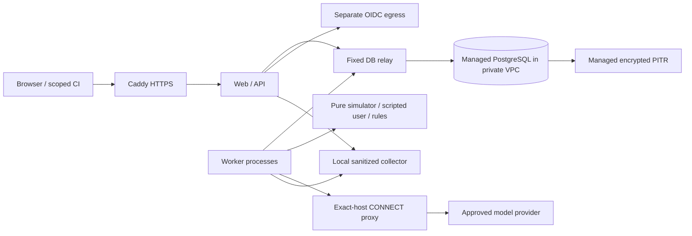

# Architecture Revision 2 - System architecture

Proposed, 1 October 2026; no implementation or release approval. Numerical settings are **PROPOSED - UNMEASURED UNTIL BENCHMARKED**.

## Retained decision

One Python/Django modular monolith, separate web and worker entry points in the same immutable OCI build, managed PostgreSQL for immutable inputs, narrow queue rows, evidence, results, audit and usage. No Celery, Redis, vector database, agent framework or microservices. PostgreSQL permits atomic admission of a run, jobs, budgets and audit without a second durable queue/outbox. SKIP LOCKED is used only for work acquisition, never as a consistent reporting query. Changing to a broker does not eliminate fencing or ambiguous provider billing.

| Module | Owns | Forbidden responsibilities |
|---|---|---|
| identity / tenancy | OIDC/session/token identity, membership, action checks, tenant transaction entry | Model SDK and evaluation policy |
| catalog | Agent/scenario/suite DSL validation, revisions, immutable publication | Executing or fetching customer content |
| jobs | Admission, scheduling groups, fairness, lease epochs, cancellation, reduction | Inventing verdicts |
| execution | Fixed loop, pure simulator, scripts, bounded trace production | Arbitrary code/imports, real tools |
| providers | Versioned request allowlist, fixed endpoint, typed transport, usage | Permission decisions, direct callers bypassing usage gateway |
| evaluation | Pure rules/heuristics/aggregation; no-tool judge request construction | SDK, database roles, job mutation |
| reporting | Frozen summaries, evidence availability, comparisons | Rewriting prior results |
| operations / usage | Audit/redaction/retention/health; ledger and budget transactions | Customer-defined scripts or endpoints |

T-002 adds import checks: only providers imports the SDK; evaluation cannot import providers or jobs (judge orchestration is in execution and passes typed results); simulator imports no I/O modules. The fake provider implements the same transport interface.

These are responsibilities, not one network service per domain module. The relay, proxy and collector are separately constrained infrastructure containers. Network isolation is design intent until proven from the worker namespace; an internal Docker network alone is not sufficient proof of host-service isolation.

## Mandatory implementation patterns

Exactly one tenant-context mechanism: explicit short `tenant_transaction` units using transaction-local context, specified in SECURITY. `ATOMIC_REQUESTS=False`, autocommit enabled outside the wrapper, no tenant SQL outside it and no session-level tenant SET. Web, workers, reaper and retention all use this mechanism after validated context acquisition. No transaction spans provider calls, OIDC requests, template rendering or sleeps.

Simple Django ORM foreign keys coexist with manually managed composite tenant/project FKs using reversible RunSQL; catalog introspection and migrated-schema tests prevent silent loss. DATA_MODEL defines the convention.

EXECUTION_MODEL owns a single lock hierarchy, fencing protocol, two-phase cancellation, dispatch quarantine, fair admission and reduction. Every code path must use it, including maintenance and failure recovery. Application-set tenant context is defense against missing filters, not security against a fully compromised trusted process.

## Deployment alternatives

Reference A: replaceable VM, Docker Compose, Caddy, constrained gateways, managed private PostgreSQL, managed OIDC, one telemetry destination, IaC-owned host firewall. Advantage: demonstrable egress and simple shared build. Cost: host patching, network ownership and recovery drills. Select only with named primary/backup operators.

Alternative B: managed web/worker platform plus managed DB. Advantage: less host maintenance. Accept only after equivalent direct-egress, DNS, metadata, IPv6, private-network and failover proofs. A proxy environment variable or a private-service setting is not evidence of outbound containment. Neither option treats ordinary containers as a hostile-code sandbox.

## Flow and scaling

Authenticate -> tenant transaction -> publish immutable agent/suite -> atomically admit evaluation and reserve authorized envelope -> fair execution-group admission -> fenced claim/attempt -> reserve/dispatch outside transaction -> persisted/redacted evidence -> pure rules and optional judge -> canonical finalize -> separate parent reducer -> report/CI. Generation follows the same controls and produces drafts only.

Initial worker model and four-slot scheduling are in EXECUTION_MODEL; REQUIREMENTS is the numerical source. Vertical tuning precedes scale changes. Proposed scale triggers: sustained claim p95 >200 ms with >20% DB CPU attributable to queue after tuning -> evaluate broker/outbox; trace working set >50 GiB or >70% of DB or restore beyond approved RTO -> object payload storage; normal queue delay >60 s with measured worker saturation and provider/budget headroom -> additional worker capacity. Additional hosts retain global DB counters and fencing. Standby DB follows an approved availability need; additional providers follow validated customer demand and adapter conformance. All thresholds remain unmeasured, and none relaxes safety gates.

## Verified technical references

Django's request transaction wrapper excludes middleware/template rendering; explicit transactions also apply to workers ([Django transactions](https://docs.djangoproject.com/en/5.2/topics/db/transactions/)). Its composite relationship limitations justify the custom constraint convention ([Django composite keys](https://docs.djangoproject.com/en/5.2/topics/composite-primary-key/)). SET LOCAL is transaction scoped ([PostgreSQL SET](https://www.postgresql.org/docs/17/sql-set.html)). Compose internal networking supplies external isolation configuration but still requires the deployed path tests specified here ([Docker networks](https://docs.docker.com/reference/compose-file/networks/)). These facts support the design; the detailed protocol is this revision's engineering recommendation.
